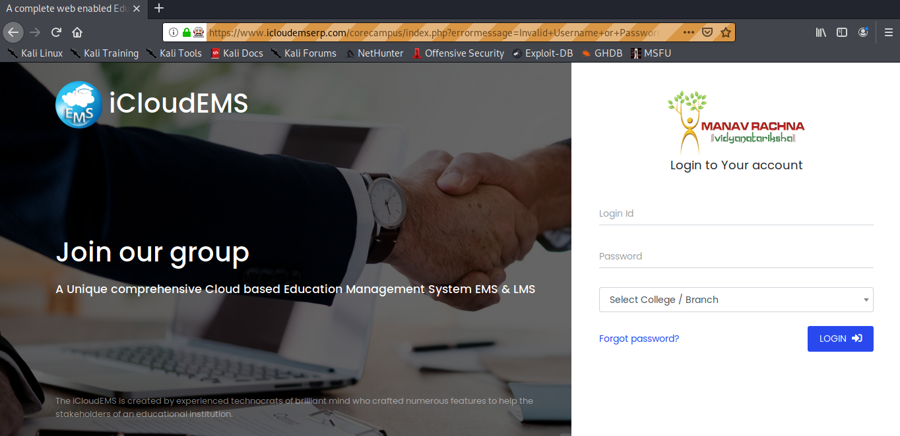
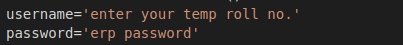

# ERP AutoLogin Automation With Python
<br>



### Change this with your trn and Password
<br>



### steps to run

* ### Install Selenium

```
python3 -m pip install selenium
```

* ### Install Firefox Web Driver's

    * ### For Linux User's
        <br>

        ```
        wget https://github.com/mozilla/geckodriver/releases/download/v0.25.0/geckodriver-v0.25.0-linux64.tar.gz
        ```
        ```
        tar xzf geckodriver-v0.25.0-linux64.tar.gz
        ```
        ```
        sudo mv geckodriver /usr/bin/geckodriver 
        ```
    * For other OS
        <br>

        ```
        https://github.com/mozilla/geckodriver/releases/
        ```
### Thanks for using :blush: